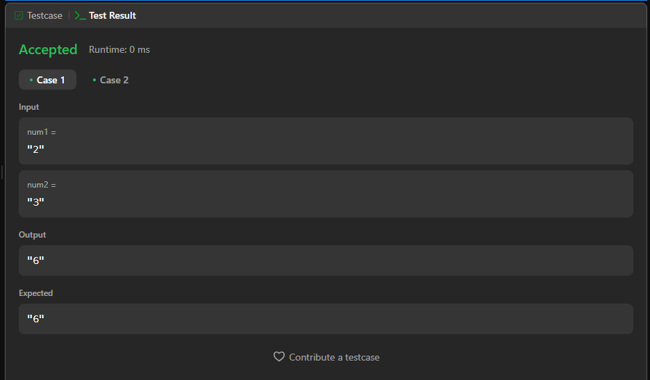

# 4. Median of Two Sorted Arrays

 [Link para Questão](https://leetcode.com/problems/median-of-two-sorted-arrays/description/)

 #### Nivel de Dificuldade: HARD

Given two non-negative integers num1 and num2 represented as strings, return the product of num1 and num2, also represented as a string.

Note: You must not use any built-in BigInteger library or convert the inputs to integer directly.

#### Example 1:

Input: nums1 = [1,3], nums2 = [2]
Output: 2.00000
Explanation: merged array = [1,2,3] and median is 2.

#### Example 2:

Input: nums1 = [1,2], nums2 = [3,4]
Output: 2.50000
Explanation: merged array = [1,2,3,4] and median is (2 + 3) / 2 = 2.5.

#### Constraints:

* nums1.length == m
* nums2.length == n
* 0 <= m <= 1000
* 0 <= n <= 1000
* 1 <= m + n <= 2000
* -106 <= nums1[i], nums2[i] <= 106

#### Test Result:

